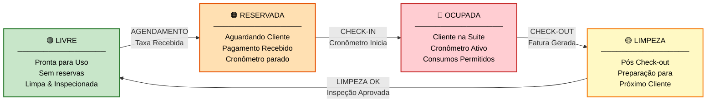
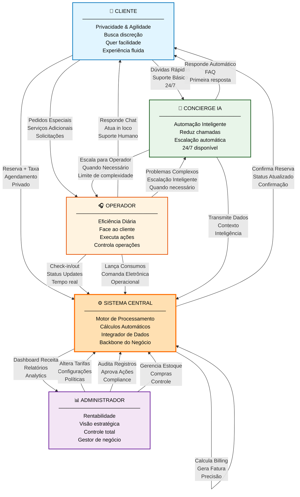

# 🏨 Luxury Motel Management System (MVP)

> **Status do Projeto:** 🚀 MVP Finalizado / Em expansão  
> **Foco:** Digitalização da jornada de luxo, privacidade e eficiência operacional

O **Luxury Motel Management System** é uma plataforma desenvolvida para modernizar a operação de motéis de alto padrão. O sistema remove os atritos tradicionais de reserva, estadia e pagamento, oferecendo uma interface ágil para a recepção e uma experiência discreta para o cliente.

---

## 🎨 Preview da Interface

**👉 [Clique aqui para visualizar o preview do projeto](https://aistudio.google.com/app/apps/drive/1DD1baGZKzZVYGGstTVggf4ARYZ-opgIB?showAssistant=true&showPreview=true)**

Veja a interface completa do sistema com todos os fluxos de usuário, diagramas e funcionalidades interativas.

---

## 📋 Índice
- [Modelo de Negócio](#modelo-de-negócio)
- [Personagens do Sistema](#personagens-do-sistema)
- [Fluxo Principal de Valor](#fluxo-principal-de-valor)
- [Regras de Negócio](#regras-de-negócio)
- [Escopo do MVP](#escopo-do-mvp)
- [Funcionalidades Incluídas](#funcionalidades-incluídas)
- [Exclusões (Roadmap Futuro)](#exclusões-roadmap-futuro)
- [Próximos Passos](#próximos-passos)

---

## 🎯 Modelo de Negócio

O sistema opera sobre três pilares:
- **Vitrine Digital**: Apresentação clara e categorizada das suítes
- **Gestão Operacional**: Controle em tempo real da disponibilidade
- **Inteligência de Receita**: Otimização de preços e operações

---

## 👥 Personagens do Sistema

| Ator | Objetivo | Necessidades |
| :--- | :--- | :--- |
| **👤 Cliente** | Privacidade + Agilidade | Vitrine clara, reserva pronta, atendimento discreto |
| **🎧 Operador (Recepção)** | Eficiência Diária | Mapa de status, check-in/out ágil, comanda eletrônica |
| **📊 Administrador (Gestor)** | Rentabilidade | Visão de receita, controle de estoque, gestão de tarifas |

---

## 🔄 Fluxo Principal de Valor

### Jornada Completa: Do Agendamento ao Pagamento

```mermaid
graph TD
    A(("👤 Cliente Acessa<br/>o Sistema de Reservas")) --> B["📱 Vitrine Digital<br/>─────────────────<br/>Cliente visualiza suítes<br/>categorizadas por nível<br/>com preços atualizados"]
    
    B --> C{"Seleciona Horário<br/>e Duração?"}
    C -->|Sim| D["💳 Taxa de Reserva<br/>─────────────────<br/>Pagamento antecipado<br/>Funciona como SINAL<br/>Configurável pelo admin"]
    C -->|Não| B
    
    D --> E["⏳ Status: RESERVADO<br/>─────────────────<br/>Sistema aguarda<br/>chegada do cliente<br/>Período de tolerância:<br/>30 minutos"]
    
    E --> F{"Cliente Chegou<br/>no Horário?"}
    
    F -->|Não| G["❌ Reserva Cancelada<br/>─────────────────<br/>Tolerância excedida<br/>Admin pode revisar<br/>e liberar manualmente"]
    
    F -->|Sim| H["✅ Check-in Confirmado<br/>─────────────────<br/>Status muda para OCUPADO<br/>Cronômetro é iniciado<br/>Suite agora ativa"]
    
    H --> I["⏱️ Cronômetro Ativo<br/>─────────────────<br/>Sistema conta o tempo<br/>em tempo real<br/>Rastreia horas base<br/>e horas extras +50%"]
    
    I --> J["🍹 Lançamento Consumo<br/>─────────────────<br/>Operador adiciona itens<br/>à comanda do cliente<br/>Abate automático<br/>do inventário"]
    
    J --> K["💬 Chat Híbrido<br/>─────────────────<br/>IA responde básico<br/>Operador assume<br/>para pedidos especiais<br/>Suporte discreto"]
    
    K --> L{"Tempo de Estadia<br/>Expirou?"}
    L -->|Não| J
    L -->|Sim| M["🚪 Check-out Realizado<br/>─────────────────<br/>Cliente deixa suite<br/>Sistema encerra contagem<br/>Gera extrato"]
    
    M --> N["💰 Cálculo Automático<br/>─────────────────<br/>Horas Base × Valor/Hora<br/>+ Horas Extras × 1.5<br/>+ Consumos Adicionais<br/>- Taxa de Reserva"]
    
    N --> O["✔️ Fatura Gerada<br/>─────────────────<br/>Extrato pronto<br/>Disponível para<br/>pagamento ou quitação"]
    
    G -.->|"Admin Pode<br/>Reimbursar"| H
    
    style A fill:#e1f5ff,stroke:#0277bd,stroke-width:3px,color:#000
    style D fill:#ffccbc,stroke:#d84315,stroke-width:2px,color:#000
    style I fill:#ffcdd2,stroke:#c62828,stroke-width:2px,color:#000
    style K fill:#bbdefb,stroke:#1565c0,stroke-width:2px,color:#000
    style N fill:#c8e6c9,stroke:#2e7d32,stroke-width:2px,color:#000
    style O fill:#a5d6a7,stroke:#1b5e20,stroke-width:3px,color:#000
```



---

## 🗂️ Mapa de Disponibilidade (Front-Desk Visual)

O operador tem uma visão em tempo real do status de cada suíte:



---

## 💰 Gestão de Receita (Painel Administrativo)

```mermaid
graph TD
    A["📊 PAINEL ADMINISTRATIVO<br/>────────────────────────<br/>Visão Central do Negócio"] --> B["Monitoramento de Receita"]
    A --> C["⚙️ Configuração de Tarifário"]
    A --> D["📦 Gestão de Estoque"]
    
    B --> B1["💵 Total Faturado Dia<br/>────────────────────<br/>Soma de todas as<br/>operações finalizadas<br/>Atualização em tempo real"]
    B --> B2["📊 Divisão por Categoria<br/>────────────────────<br/>Simples / Plus / Premium<br/>Comparativa de desempenho<br/>Fácil identificação de trends"]
    B --> B3["📈 Taxa de Ocupação %<br/>────────────────────<br/>Horas ocupadas vs<br/>horas disponíveis<br/>KPI principal"]
    
    C --> C1["💰 Ajuste Valor/Hora<br/>────────────────────<br/>Alterar preço por<br/>categoria de suite<br/>Controle ativo de preços"]
    C --> C2["🏷️ Taxa de Reserva<br/>────────────────────<br/>Sinal antecipado<br/>Reduz no-show<br/>Configurável"]
    C --> C3["⏱️ Tolerância Atraso<br/>────────────────────<br/>Período de carência<br/>até cancelamento<br/>Padrão: 30 min"]
    
    D --> D1["📝 Cadastro Produtos<br/>────────────────────<br/>Bebidas, Conveniência<br/>Preço venda & custo<br/>Informações completas"]
    D --> D2["📦 Controle Quantidade<br/>────────────────────<br/>Estoque em tempo real<br/>Impossível vender<br/>sem estoque"]
    D --> D3["⚡ Abate Automático<br/>────────────────────<br/>Reduz em tempo real<br/>Integrado com comanda<br/>Zero manual"]
    
    style A fill:#bbdefb,stroke:#1565c0,stroke-width:3px,color:#000
    style B fill:#b3e5fc,stroke:#0277bd,stroke-width:2px,color:#000
    style C fill:#f8bbd0,stroke:#c2185b,stroke-width:2px,color:#000
    style D fill:#ffe0b2,stroke:#e65100,stroke-width:2px,color:#000
    style B1 fill:#e3f2fd,stroke:#0277bd,stroke-width:1px,color:#000
    style B2 fill:#e3f2fd,stroke:#0277bd,stroke-width:1px,color:#000
    style B3 fill:#e3f2fd,stroke:#0277bd,stroke-width:1px,color:#000
    style C1 fill:#fce4ec,stroke:#c2185b,stroke-width:1px,color:#000
    style C2 fill:#fce4ec,stroke:#c2185b,stroke-width:1px,color:#000
    style C3 fill:#fce4ec,stroke:#c2185b,stroke-width:1px,color:#000
    style D1 fill:#fff3e0,stroke:#e65100,stroke-width:1px,color:#000
    style D2 fill:#fff3e0,stroke:#e65100,stroke-width:1px,color:#000
    style D3 fill:#fff3e0,stroke:#e65100,stroke-width:1px,color:#000
```



---

## 📏 Regras de Negócio Cruciais

### 1️⃣ **Regra do Depósito (Taxa de Reserva)**
- O cliente paga uma taxa fixa no agendamento
- Funciona como um **sinal/crédito antecipado**
- No fechamento, esse valor é **abatido do total final**
- **Objetivo:** Reduzir "no-show" (reservas que não aparecem)

### 2️⃣ **Regra de Hora Extra**
- Se o cliente exceder o tempo contratado → aplica **tarifa diferenciada**
- Acréscimo padrão: **+50% sobre o valor da hora base**
- **Objetivo:** Desestimular atrasos sem aviso, maximizando o turnover

### 3️⃣ **Regra de Tolerância**
- Carência padrão: **30 minutos** para chegada
- A reserva é cancelada automaticamente após o período
- Admin pode justificar e liberar a suíte manualmente

### 4️⃣ **Regra de Comanda Eletrônica**
- Todo consumo lançado abate **automaticamente do inventário**
- Cada item tem preço de venda ≠ preço de custo
- Impossível vender produto com estoque = 0

### 5️⃣ **Hierarquia de Acesso**
- **Operadores:** Ver status, fazer check-in/out, lançar consumo, chat
- **Administradores:** Exclusivo para alterar tarifas, apagar registros, gerenciar estoque
- **Sistema:** Calcula automaticamente, sem intervenção manual

---

## 🎁 Escopo do MVP (Produto Mínimo Viável)

O MVP abaixo é o **escopo oficial** para lançamento inicial da plataforma:

### ✅ O QUE ESTÁ INCLUÍDO (MVP)

#### 1. **Front-Desk Digital**
- Mapa visual de suítes (Livre → Reservada → Ocupada)
- Transições automáticas de status
- Check-in e check-out com 1 clique
- Tempo de ocupação contado em tempo real

#### 2. **Vitrine Digital & Agendamento**
- Exibição de suítes categorizadas por nível
  - Simples
  - Plus
  - Premium
- Visualização de itens inclusos por categoria
- Seleção de horário de entrada
- Seleção de duração da estadia
- Cálculo dinâmico de preço (horário × número de horas)

#### 3. **Sistema de Reserva com Garantia**
- Taxa de reserva fixa (configurável pelo admin)
- Pagamento antecipado (funciona como sinal)
- Período de tolerância (30 min padrão)
- Status de "Reservado" com limite de tempo

#### 4. **Chat Híbrido (IA + Humano)**
- **Concierge IA:** Responde dúvidas comuns
  - Preços
  - Regras da casa
  - Informações de suíte
- **Escalação Humana:** Operador assume para
  - Pedidos de comida/bebida
  - Solicitações de limpeza/manutenção
  - Problemas técnicos

#### 5. **Comanda Eletrônica**
- Lançamento de itens consumidos
- Abate automático do estoque
- Inclusão imediata na conta do cliente
- Sem cálculo manual

#### 6. **Billing Automatizado**
- Fórmula: **(Horas Base × Valor/Hora) + (Horas Extras × 1.5x) + Consumos - Taxa de Reserva**
- Cálculo automático sem erros
- Extrato gerado ao encerramento
- Pronto para pagamento/quitação

#### 7. **Gestão de Inventário**
- Cadastro de produtos (bebidas, conveniência)
- Preço de venda por item
- Controle de quantidade
- Impossível vender sem estoque
- Visualização de consumo total (dia)

#### 8. **Painel Administrativo Básico**
- Monitoramento de receita (total do dia)
- Divisão por categoria de suíte
- Taxa de ocupação percentual
- Configuração de tarifas (valor/hora por suíte)
- Ajuste de taxa de reserva
- Configuração da tolerância de atraso

---

## ❌ Exclusões (Roadmap Futuro)

O que **NÃO está no escopo atual** (será implementado depois):

### 1. **Integração com Gateways de Pagamento**
- ❌ Cartão de crédito direto no sistema
- ❌ Pix automático
- ❌ Parcelamento
- 📌 **Status:** Atualmente, fatura é gerada e enviada. Cliente paga em outro canal.

### 2. **Relatórios de Histórico**
- ❌ Análise de períodos anteriores
- ❌ Comparativo mês a mês
- ❌ Exportação de dados em PDF/Excel
- 📌 **Status:** Sistema focado no "hoje". Histórico armazenado mas não exposto.

### 3. **Sistema de Governança (Limpeza/Manutenção)**
- ❌ Workflow de limpeza pós check-out
- ❌ Atribuição de tarefas a funcionários
- ❌ Checklist de inspeção
- 📌 **Status:** Mapa de Limpeza futura, mas sem automação de tarefas.

### 4. **Integração de Canais (OTA)**
- ❌ Sincronização com Booking, Airbnb, etc.
- ❌ Atualização automática de calendário
- 📌 **Status:** Roadmap longo prazo.

### 5. **Sistema de Governança Avançado**
- ❌ Rastreamento de tarefas de TI/Manutenção
- ❌ Alertas se suíte ficar tempo demais em limpeza
- 📌 **Status:** Expansão futura.

---

## 🎮 Funcionalidades Incluídas em Detalhes

### Para o Cliente
```
✅ Visualizar suítes disponíveis
✅ Agendar hora e duração
✅ Efetuar pagamento da taxa de reserva
✅ Chat com IA/Recepção
✅ Visualizar resumo da conta antes do check-out
```

### Para o Operador
```
✅ Visualizar mapa em tempo real
✅ Fazer check-in/check-out
✅ Lançar consumos na comanda
✅ Responder chat (com escalonamento para IA)
✅ Visualizar pendências e avisos
```

### Para o Administrador
```
✅ Dashboard com receita do dia
✅ Ajustar preços e tarifas
✅ Gerenciar estoque de produtos
✅ Visualizar taxa de ocupação
✅ Apagar/corrigir registros (permissão exclusiva)
```

---

## 🚀 Próximos Passos (Decisão Estratégica)

Após o lançamento do MVP, há dois caminhos principais:

### **Opção A: Aprofundar Automação de Pagamento**
- Integrar com Stripe/Mercado Pago/PagSeguro
- Tokenizar cartão do cliente
- Débito automático ao fechamento
- Recibos digitais
- **Impacto:** Reduzir atritos de pagamento, melhora fluxo de caixa

### **Opção B: Expandir Controle de Equipe (Limpeza)**
- Sistema de tarefas pós check-out
- Atribuição automática/manual
- Checklist de qualidade
- Tempo médio de limpeza
- Alertas de demora
- **Impacto:** Otimizar turnover, reduzir ociosidade

**Recomendação:** Validar com usuários reais qual dor é maior antes de investir.

---

## 📊 Diagrama de Relacionamento dos Atores



---

## 📝 Conclusão

Este MVP é o **"produto pronto para o mercado"** que remove os principais atritos de operação de motéis de luxo:
- Cliente tem privacidade e agilidade ✅
- Operador tem visibilidade total ✅
- Admin tem controle de receita ✅

O sistema está **pronto para validação com usuários reais**. Após essa validação, decidimos se expandimos para pagamentos automáticos ou otimizamos a equipe de limpeza.

---

**Última atualização:** Fevereiro de 2026
